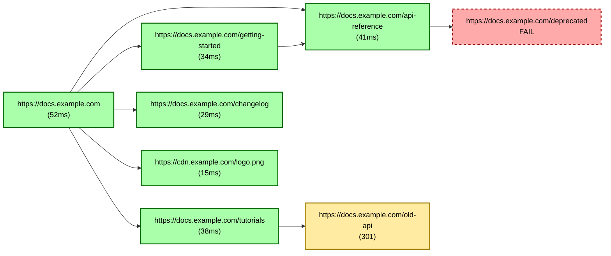

# Recursive Website Health Checker

A concurrent web crawler written in Go that probes websites, extracts links (including from JavaScript-rendered pages), and generates detailed health reports with latency breakdowns and visual dependency graphs.

## Features

- **Concurrent Crawling**: Worker pool pattern for efficient parallel processing
- **Deep Latency Analysis**: Measures DNS, TCP, and TLS handshake times separately
- **JavaScript Rendering**: Uses headless Chrome to handle SPAs and CSR pages
- **Infinite Scroll Support**: Automatically scrolls to load lazy content
- **Smart Link Extraction**: Combines DOM parsing with regex scanning of JS bundles
- **Mermaid Visualization**: Generates interactive dependency graphs
- **Retry Logic**: Exponential backoff for resilient probing

## Prerequisites

- **Go 1.21+**
- **Google Chrome** (for headless browsing)

## Installation

```bash
git clone https://github.com/Isaac-Abell/recursive-website-health-checker.git
cd recursive-website-health-checker
go mod download
```

## Usage

```bash
# Build
go build -o health-checker.exe .

# Run with defaults
./health-checker.exe

# Run with custom URL and worker count
./health-checker -url https://example.com -workers 10
```

### CLI Flags

| Flag | Default | Description |
|------|---------|-------------|
| `-url` | `https://isaacabell.com` | Starting URL for the crawl |
| `-workers` | `5` | Number of concurrent worker goroutines |

> **⚠️ Important:** The `-url` flag sets the starting point, but **you must also edit `policy.go`** to allow crawling on your target domain. Update the `validateURL()` function to include your domain(s) in the allowlist.

## Configuration

| Setting | File | How to Change |
|---------|------|---------------|
| Seed URL | CLI | Use `-url` flag |
| Worker Count | CLI | Use `-workers` flag |
| **Allowed Domains** | `policy.go` | Edit `validateURL()` to add your domain |
| Timeouts | `prober.go` | Modify `DefaultProbeConfig()` |

## Example Report

When run via GitHub Actions (or locally), the crawler generates `crawl_report.md`. Here's what a typical report looks like for a multi-page site with various assets:

---

### Crawl Visualization Summary
**Date:** Mon, 26 Jan 2026 15:23:11 EST

#### 1. Network Graph (Coalesced)
Dependencies found inside `.js` files are shown as direct links from the parent page.



#### 2. Request Details
| Ind | URL | Status | Depth | DNS | TCP | TLS | Total | Error |
|:---:|---|---|:---:|---|---|---|---|---|
| 🟢 | `https://docs.example.com` | 200 | 0 | 32.5ms | 5.2ms | 14.3ms | **52.0ms** |  |
| 🟢 | `https://docs.example.com/getting-started` | 200 | 1 | 0s | 12.4ms | 21.6ms | **34.0ms** |  |
| 🟢 | `https://docs.example.com/api-reference` | 200 | 1 | 0s | 18.2ms | 22.8ms | **41.0ms** |  |
| 🟢 | `https://docs.example.com/tutorials` | 200 | 1 | 0s | 15.1ms | 22.9ms | **38.0ms** |  |
| 🟢 | `https://docs.example.com/changelog` | 200 | 1 | 0s | 8.3ms | 20.7ms | **29.0ms** |  |
| 🟢 | `https://cdn.example.com/logo.png` | 200 | 1 | 8.2ms | 3.1ms | 3.7ms | **15.0ms** |  |
| 🔴 | `https://docs.example.com/deprecated` | **404** | 2 | 0s | 11.2ms | 19.8ms | **31.0ms** |  |
| 🟡 | `https://docs.example.com/old-api` | 301 | 2 | 0s | 9.4ms | 18.6ms | **28.0ms** |  |
| 🟢 | *https://docs.example.com/assets/main.js* | 200 | 1 | 0s | 7.8ms | 12.2ms | **20.0ms** |  |
| 🟢 | *https://docs.example.com/assets/vendor.js* | 200 | 1 | 0s | 6.9ms | 11.1ms | **18.0ms** |  |

---

## Architecture

```
┌─────────────┐     ┌──────────────┐     ┌─────────────┐
│   main.go   │────▶│  scout.go    │────▶│ prober.go   │
│ Coordinator │     │ Orchestrator │     │ HTTP Client │
└─────────────┘     └──────────────┘     └─────────────┘
                           │
            ┌──────────────┴──────────────┐
            ▼                              ▼
    ┌──────────────┐              ┌──────────────┐
    │scrapePage.go │              │ policy.go    │
    │Chrome/Regex  │              │ URL Validator│
    └──────────────┘              └──────────────┘
                           │
                           ▼
                    ┌──────────────┐
                    │visualize.go  │
                    │Report Gen    │
                    └──────────────┘
```

## File Structure

| File | Purpose |
|------|---------|
| `main.go` | Entry point, CLI flags, worker pool coordination |
| `types.go` | Core data structures (Task, Result, Latencies) |
| `scout.go` | High-level crawl logic and strategy selection |
| `prober.go` | HTTP requests with latency tracing and retries |
| `scrapePage.go` | Link extraction via Chrome and regex |
| `policy.go` | URL validation and crawl scope rules |
| `visualize.go` | Markdown/Mermaid report generation |
| `generateGraph.go` | Graph coalescing algorithm |

## GitHub Actions

This repo includes a workflow (`.github/workflows/crawl.yml`) that:
- Runs weekly on Mondays at 8am UTC (or manually via workflow_dispatch)
- Installs Go and Chrome
- Executes the health check
- Outputs the full report to the **GitHub Actions Job Summary**
